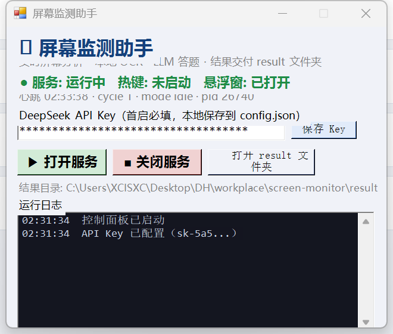
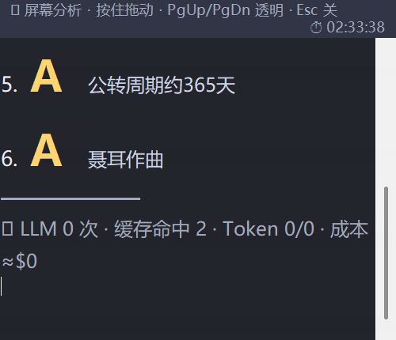

# 屏幕监测助手（Screen Monitor Assistant）

Windows 实时屏幕分析工具：持续观察你的屏幕，用**本地 OCR**（零云端费用、无限流）提取文字与题目，交给 **DeepSeek AI** 作答，结果展示在**悬浮窗**里——全程由一个小巧的**图形控制台**管理。


-green)


---

## 功能特性

- 🖥️ **实时屏幕监测** — 每 3 秒截屏，仅在画面变化时分析（防抖 2 秒）
- 📝 **本地 OCR** — Windows 内置 OCR 引擎，完全离线、免费、永不限流
- 🤖 **AI 答题** — 选择题/判断题由 DeepSeek 逐题作答并给出理由
- 🪟 **悬浮窗** — 可拖拽、半透明、答案字母大号高亮、始终置顶
- 🎛️ **图形控制台** — 一键开关整套服务、管理 API Key、实时状态与日志
- ⌨️ **全局热键** — `Ctrl+Shift+S` 立即分析当前屏幕
- 🧠 **智能缓存** — LLM 答案持久化缓存（LRU）+ OCR 微抖动模糊匹配，省 token 省钱
- 📂 **结果交付** — 所有结果输出到独立 `result/` 文件夹（result.json、历史、成本统计）
- 🧹 **隐私控制** — 可选分析区域（`analyzeRegion`），悬浮窗自动排除在分析之外

## 截图





## 快速开始

1. **下载/克隆**本仓库；
2. **运行** `启动屏幕监测助手.bat`（或 `monitor-console.ps1`）打开控制台；
3. **填入你的 DeepSeek API Key**（到 <https://platform.deepseek.com> 注册获取），点「保存 Key」；
4. 点 **「▶ 打开服务」** —— 监测开始，悬浮窗出现在右上角；
5. 完成。把题目/文字显示在屏幕上，答案几秒内出现在悬浮窗。

> 仅首次需要：`config.json` 的 `apiKey` 默认为空——控制台会提示你填写。

## 使用说明

| 操作 | 方法 |
|---|---|
| 开始监测 | 控制台 → **▶ 打开服务** |
| 停止监测（同时关闭悬浮窗） | 控制台 → **■ 关闭服务** |
| 立即分析当前屏幕 | 按 **Ctrl+Shift+S** |
| 移动悬浮窗 | 按住顶部拖拽条拖动 |
| 悬浮窗透明度 | `PgUp` / `PgDn`（30%–100%） |
| 关闭悬浮窗 | `Esc` |
| 查看结果 | 控制台 → **📂 打开 result 文件夹** |

## 配置说明

所有配置在 `config.json`：

| 字段 | 说明 |
|---|---|
| `intervalSec` | 截屏间隔（秒） |
| `debounceSec` / `maxWaitSec` | 画面稳定后分析 / 强制分析上限 |
| `analyzeRegion` | 限定分析区域（`enabled`、`x`、`y`、`w`、`h`） |
| `excludeRegion` | 排除区域（悬浮窗自身，自动同步） |
| `llm.enabled` / `apiKey` / `model` | DeepSeek 设置 |
| `llm.cacheMax` / `cacheSimilarity` | LLM 缓存条数 / 模糊匹配阈值（0 = 仅精确哈希） |
| `llmCost.*` | 每百万 token 单价（美元），用于成本估算 |

## 项目结构

```
screen-monitor/
├── monitor-console.ps1     # 图形控制面板
├── monitor-service.ps1     # 核心服务（截屏/OCR/LLM/发布）
├── overlay-window.ps1      # 悬浮窗
├── hotkey.ps1              # 全局热键监听（Ctrl+Shift+S）
├── ocr.ps1                 # 独立本地 OCR 工具
├── config.json             # 配置（API Key 默认留空）
├── 启动屏幕监测助手.bat       # 控制台启动器
├── quiz-full.html          # 测试答题页（6 题）
└── result/                 # 输出：result.json、history.jsonl、stats.json、overlay.txt/html
```

## 工作原理

```
屏幕 ──(每 3 秒截屏)──> 变化检测 ──(防抖 2 秒)──> 本地 OCR
    ──> 启发式识别答题场景 ──> DeepSeek LLM（带缓存）──> 悬浮窗 + result/
```

- **仅支持文字题。** 图片题（"如图/看图"类）暂不支持。
- 滚动：只分析屏幕可见部分；滚动后停 2 秒继续补全。
- 隐私：屏幕数据本地处理；仅答题场景才将 OCR 文本发送给 DeepSeek。

## 免责声明

- 本工具会截取你的屏幕。请负责任地使用——不要在不想被处理的敏感内容上运行。
- 自动答题可能违反考试/答题平台的规则。使用后果自负。
- 你的 API Key 明文保存在本地 `config.json`——**切勿提交到任何公开仓库**。

## 开源协议

MIT —— 可自由使用、修改与分享。
